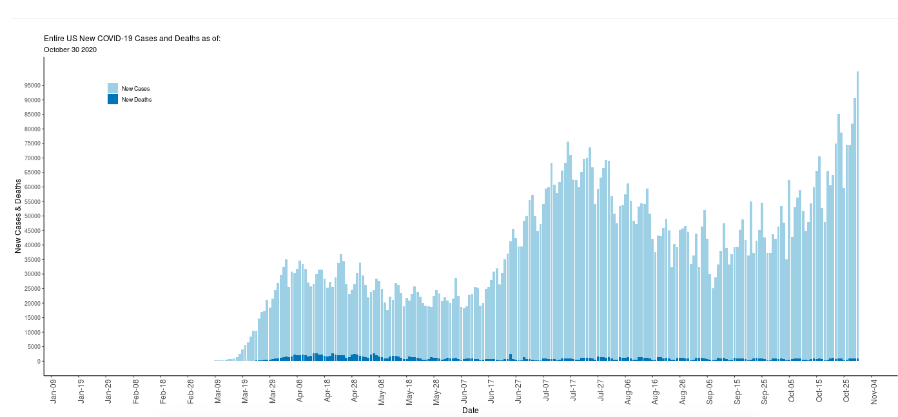

I grew up in Olympia, WA and now live in New York City where I do public health by day and design sets and costumes for theatre by night. I'm interested in sustainable design, as well as responsibly using data to communicate public health research to a wider audience, with the goal of informing policy and practice. I love to doodle, organize, read, hike, and cook.

MPH candidate, Columbia University  
BA Barnard College

**********

### Projects

:::::: {style="display: flex;"}

::: {width="20%"}
[Set & costume design website](https://isabelsnelson.wixsite.com/design)

:::

::: {width="20%"}

spacing text

:::

::: {width="20%"}
[COVID-19 outbreak visualization app](https://isabelsnelson.shinyapps.io/Covid-19_Tracking/?_ga=2.115800385.63367316.1592790986-1470516770.1589839160)
 

:::

::::::

