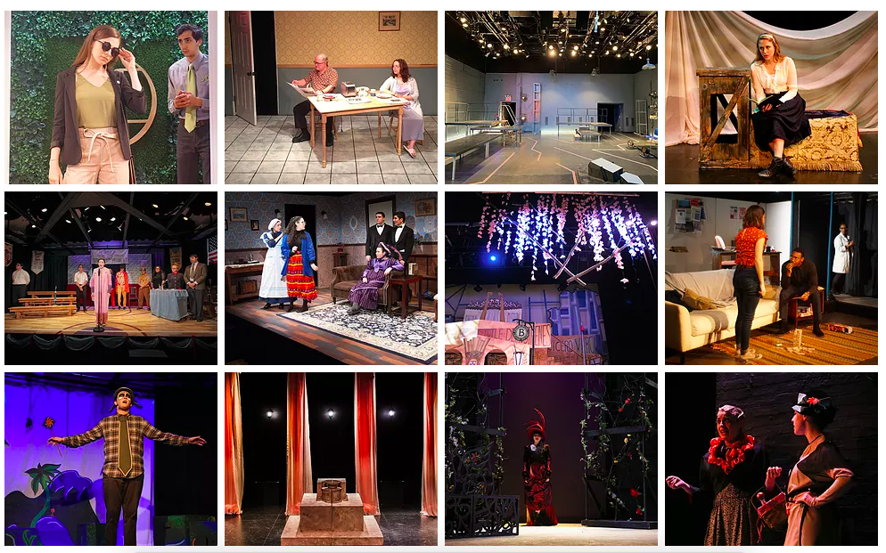

### About me 
I grew up in Olympia, WA and now live in New York City where I do public health by day and design sets and costumes for theatre by night. I'm interested in sustainable design, as well as using data responsibly to communicate public health research to a wider audience and inform policy and practice. I love to doodle, organize, read, hike, and eat.

MPH candidate, Columbia University  
BA Barnard College

### Projects

:::::: {style="display: flex;"}

::: {width="20%"}
[Set & Costume Design Website](https://isabelsnelson.wixsite.com/design)

:::

::: {width="20%"}
\
<!--Spacing -->

:::

::: {width="20%"}
[COVID-19 outbreak visualization app](https://isabelsnelson.shinyapps.io/Covid-19_Tracking/?_ga=2.115800385.63367316.1592790986-1470516770.1589839160)
 

:::

::::::

## Questions from video lectures
- How do you remove a website once it's made on github? 

## Homework instructions
Problem 1
Create a personal website at <YOUR_GH_NAME>.github.io (or some other reasonably-named location). This page can be as extensive as you’d like, but it should include at least:

A page giving your academic and professional experience (i.e. a resume)
Links in the site navigation for your GitHub account, your email, and other professional networks.  

Problem 2
Create a flexdashboard using plotly for that includes at least three distinct plot types (e.g. scatterplots, line plots, bar plots, box plots, etc.). Use one of the following datasets, and load from the p8105.datasets package:

Instacart
NY NOAA
NYC Restaurant Inspections
These datasets are large; you may want / need to filter or randomly sample from the complete dataset to ensure a reasonable product.

